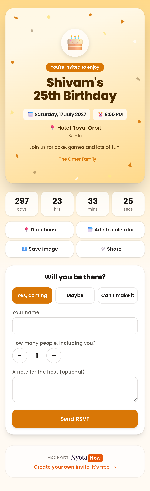
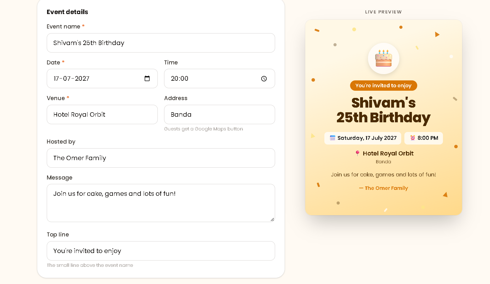
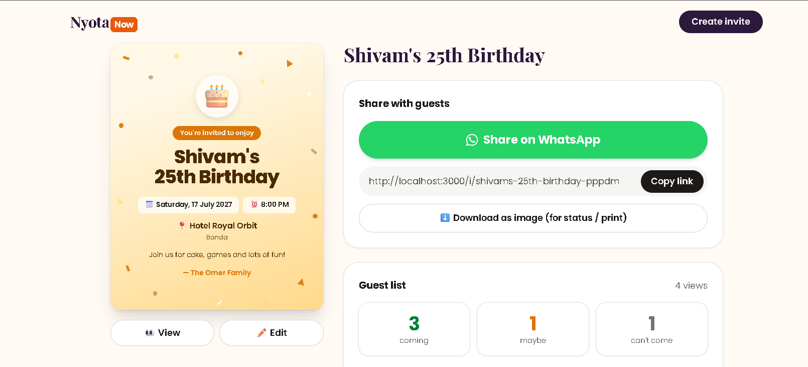
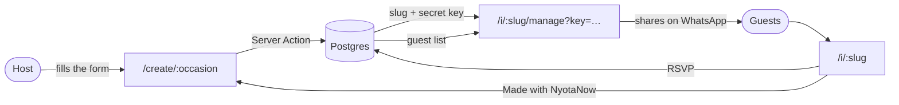
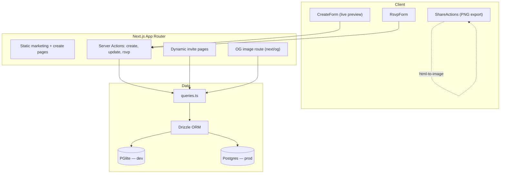
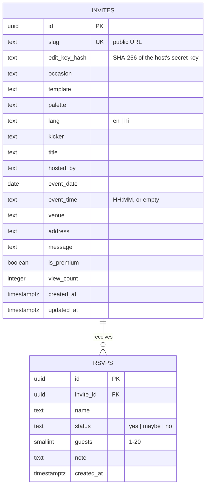

<div align="center">

# NyotaNow

**न्योता भेजिए, स्टाइल में** · Beautiful invitations in 60 seconds, shared as a link on WhatsApp.

[](https://nextjs.org)
[](https://react.dev)
[](https://www.typescriptlang.org)
[](https://tailwindcss.com)
[](https://orm.drizzle.team)

**[Try it live → nyotanow.vercel.app](https://nyotanow.vercel.app)**

</div>

---

## The problem

Inviting people to a birthday, a griha pravesh or a pooja in India means forwarding a JPG on
WhatsApp and then chasing everyone individually: *"aa rahe ho?"*, *"address bhej do"*,
*"kitne log aaoge?"*. The host ends up maintaining a headcount in their own head, and the
image itself is a dead end: it can't answer a question, can't open a map, can't tell you who
is coming.

## The idea

**An invitation should be a link, not a picture.**

The host fills in a few details, picks a design, and gets one link. That link is a small web
page that counts down to the event, opens Google Maps, adds the date to the guest's calendar,
and collects RSVPs in one tap. The host gets a private page showing exactly who is coming.

Because every invite ends with *"Made with NyotaNow, create your own"*, each event puts the
product in front of 30–80 guests. That is the growth loop: no ad spend.

Hindi and English are both first-class, with proper Devanagari typography, not a
machine-translated afterthought. That is the main gap left by the global design tools.

---

## Screenshots

<table>
  <tr>
    <td width="32%" valign="top">
      <b>What guests see</b><br />
      <sub>Countdown, directions, calendar and one-tap RSVP</sub><br /><br />
      
    </td>
    <td valign="top">
      <b>Create, with a live preview</b><br />
      <sub>The card updates as you type</sub><br /><br />
      
      <br /><br />
      <b>The host's private page</b><br />
      <sub>Share on WhatsApp and see who's coming</sub><br /><br />
      
    </td>
  </tr>
</table>

---

## Features

**For the host**
- 6 occasions: birthday, anniversary, griha pravesh, baby shower (godh bharai), pooja/kirtan, party
- 3 card designs × 7 colour palettes, with a preview that updates as you type
- English or हिंदी, with sensible default wording per occasion in both
- No sign-up. An invite is live in under a minute
- Private page with the guest list, headcount and view count; editable after publishing

**For the guest**
- Live countdown to the event
- Directions (Google Maps) and Add to calendar (Google Calendar) in one tap
- RSVP with Yes / Maybe / No plus how many people they're bringing; changeable later
- Save the card as a 1080×1350 PNG for WhatsApp status or printing

**Under the hood**
- Rich link previews when the invite is pasted into WhatsApp (generated per invite)
- Invite pages are `noindex`; only the marketing pages are crawlable, with a sitemap and robots.txt
- Invite pages are server-rendered, so they open fast on a slow phone and read correctly before JS loads

---

## How it works



The loop closes at the bottom: guests who open an invite become the next hosts.

## Architecture



**Rendering strategy:** the homepage and the six `/create/*` pages are prerendered at build
time, so the pages that need to rank on Google are static and effectively free to serve.
Invite pages are `force-dynamic`, because an edited invite or a new RSVP must be visible
immediately.

## Data model



---

## Engineering notes

The decisions in here that were not obvious:

**One card component, three surfaces.** The card renders in the live preview, on the invite
page, and in the downloaded PNG. It's sized entirely in container-query units (`cqw`), so a
single component scales from a 320px preview to a 1080px export with identical layout, with no
duplicated styles.

**PNG export that actually matches the screen.** `html-to-image` copies each element's
computed styles into an SVG and rounds every font-size down to `floor(px) - 0.1`. On the
small on-screen card that's up to a ~3% shrink, enough to re-wrap a title that sits near a
line break, while the copied height stays put, so text overlaps. Two changes fixed it: the
card is exported from an off-screen copy rendered at the full 1080px (sharper, and the
rounding matters less at larger sizes), and, the part that actually made it reliable, every
text line stretches to the card's width instead of shrink-wrapping its own content, so
wrapping depends on the card and not on glyph widths.

**Devanagari.** Hindi cards name the Devanagari font first instead of reaching it through the
English font's per-glyph fallback, so the result doesn't depend on how each browser walks the
fallback chain. Satori (which powers `next/og`) cannot shape Devanagari at all, so the WhatsApp
preview image substitutes English text for Hindi titles. The invite page and the PNG export
remain fully Hindi.

**Two database drivers, one codebase.** `DATABASE_URL` unset means development, where an
embedded PGlite database runs in-process, so the project needs no Docker and no setup. Set it
and the same Drizzle queries run against a real Postgres. Migrations are plain SQL strings that
run on first connection, guarded by a Postgres advisory lock so concurrent cold starts can't
race.

**No accounts, but not insecure.** Hosts don't want to sign up to invite people to a birthday,
so each invite issues a random 24-character key; only its SHA-256 hash is stored and it's
compared in constant time. An invalid key returns the same 404 as a nonexistent invite, so
links can't be probed. The browser remembers the host's links.

**Timezones.** Every event is in IST, so dates are interpreted in `Asia/Kolkata` explicitly
rather than depending on the server's clock, and the countdown renders only after hydration to
keep server and client markup identical.

---

## Project structure

```
src/
├─ app/
│  ├─ page.tsx                  landing page
│  ├─ actions.ts                server actions: create, update, rsvp
│  ├─ create/[occasion]/        create flow + SEO landing pages (static)
│  └─ i/[slug]/
│     ├─ page.tsx               public invite (dynamic)
│     ├─ opengraph-image.tsx    WhatsApp/social preview image
│     ├─ manage/                host's private page, key-guarded
│     └─ edit/                  edit an existing invite
├─ components/
│  ├─ InviteCard.tsx            the card: 3 templates, container-query sized
│  ├─ CreateForm.tsx            form + live preview
│  ├─ RsvpForm.tsx              guest RSVP
│  ├─ ShareActions.tsx          WhatsApp, copy, native share, PNG export
│  └─ Countdown.tsx             hydration-safe countdown
├─ db/
│  ├─ schema.ts                 Drizzle tables
│  ├─ migrations.ts             append-only SQL migrations
│  ├─ queries.ts                all data access
│  └─ index.ts                  driver selection + migration runner
└─ lib/
   ├─ occasions.ts              occasions and their bilingual defaults
   ├─ themes.ts                 templates and colour palettes
   ├─ invite.ts                 validation, dates, share/calendar/map links
   └─ i18n.ts                   guest-facing strings (en / hi)
```

## Run locally

```bash
npm install
npm run dev
```

Open http://localhost:3000. No database setup: PGlite creates one under `./.data/` and
migrations run on the first request. Delete that folder for a clean slate.

```bash
npm run build     # production build
npm run lint      # eslint
npx tsc --noEmit  # type check
```

## Deploy

Runs on free tiers (Vercel + Neon). The live site uses the Vercel Marketplace Neon integration:

1. Import the repo on Vercel and set `NEXT_PUBLIC_SITE_URL` to your production URL
   (e.g. `https://nyotanow.vercel.app`).
2. In Vercel → Storage, create a Neon database and connect it to the project. **Set the
   environment variable prefix to `DATABASE`** so it injects `DATABASE_URL`. The dialog
   defaults to `STORAGE`, which would create `STORAGE_URL`; the build would still pass, but
   the first invite would fail.
3. Redeploy. Migrations apply automatically on the first request.

Putting the server and database in the same region matters. For Indian users, pick
Singapore for the Neon database and set the project's Function Region to `sin1`
(Settings → Functions). A Neon database's region can't be changed after creation.

Any other Postgres works too: set `DATABASE_URL` to its pooled connection string.

---

## Roadmap

- [ ] Rate limiting on invite creation and RSVPs
- [ ] Paid tier: remove branding, premium templates (UPI via Razorpay)
- [ ] Wedding mode: multiple events (haldi, mehendi, sangeet, reception) on one page
- [ ] WhatsApp reminders to guests the day before
- [ ] More languages: Marathi, Gujarati, Tamil, Telugu
- [ ] Photo gallery on the invite after the event

## Author

**Shivam Omer** — Backend Developer with DevOps expertise

[Portfolio](https://shivam-portfolio-gold-omega.vercel.app/) ·
[GitHub](https://github.com/shane-Coder) ·
[LinkedIn](https://www.linkedin.com/in/programmer-shivam/) ·
[Medium](https://medium.com/@shivamrajomar)

© 2026 Shivam Omer. All rights reserved.
